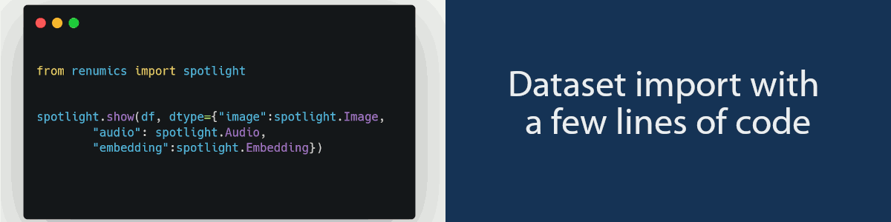

<p align="center"><a href="https://spotlight.renumics.com"></a></p>
<h1 align="center">Renumics Spotlight</h1>
<p align="center">Data curation tool for your modular ML stack.</p>

<p align="center">
	<a href="https://github.com/renumics/spotlight"></a>    
 	<a href="https://pypi.org/project/renumics-spotlight/"></a>   
 	<a href="https://pypi.org/project/renumics-spotlight/"></a>   
</p>

  <h3 align="center">
   <a href="https://spotlight.renumics.com"><b>Documentation</b></a> &bull;  
   <a href="https://spotlight.renumics.com/category/-examples"><b>Examples</b></a> &bull; 
   <a href="https://renumics.com/blog/"><b>Blog</b></a> &bull; 
   <a href="https://spotlight.renumics.com/api/spotlight/"><b>API Reference</b></a> 
 </h3>

<p align="center"><a href="https://spotlight.renumics.com"></a><a href="https://spotlight.renumics.com"></a></p>

Spotlight helps you to **identify critical data segments and model failure modes**. It enables you to build and maintain reliable machine learning models by **curating high-quality datasets**.

> We are in the process of releasing the core version of Renumics Spotlight on Github under the MIT license. Spotlight is already available on [PyPI](https://pypi.org/project/renumics-spotlight/).

## 🚀 Introduction

Spotlight is built on the idea that you can only **truly understand unstructured datasets** if you can **interactively explore** them. Its core principle is to identify and fix critical data segments by leveraging **data enrichments** (e.g. features, embeddings, uncertainties). Pre-defined templates for typical data curation workflows get you started quickly and connect your stack to the data-centric AI ecosystem.

We at [Renumics](https://renumics.com) are building Spotlight for cross-functional teams who want to be in **control of their data and data curation processes**. Currently, Spotlight supports many use cases based on image, audio, video and time series data.

## ⏱️ Quickstart

Get started by installing Spotlight and loading your first dataset.

#### What you'll need

- [Python](https://www.python.org/downloads/) version 3.7-3.10

#### Install Spotlight via [pip](https://packaging.python.org/en/latest/key_projects/#pip)

```bash
pip install renumics-spotlight
```

> We recommend installing Spotlight and everything you need to work on your data in a separate [virtual environment](https://docs.python.org/3/tutorial/venv.html).

#### Load a dataset and start exploring

```python
import pandas as pd
from renumics import spotlight

df = pd.read_csv("https://spotlight.renumics.com/data/mnist/mnist-tiny.csv")
spotlight.show(df, dtype={"image": spotlight.Image, "embedding": spotlight.Embedding})
```

`pd.read_csv` loads a sample csv file as a pandas [DataFrame](https://pandas.pydata.org/docs/reference/api/pandas.DataFrame.html).

`spotlight.show` opens up spotlight in the browser with the pandas dataframe ready for you to explore. The `dtype` argument specifies custom column types for the browser viewer.

#### Load a [Hugging Face](https://huggingface.co/) dataset

```python
import datasets
from renumics import spotlight

dataset = datasets.load_dataset("olivierdehaene/xkcd", split="train")
df = dataset.to_pandas()
spotlight.show(df, dtype={"image_url": spotlight.Image})
```

> The `datasets` package can be installed via pip.

## 🧭 Start by use case

You can adapt Spotlight to your data curation tasks. To get you started quickly, we are continuously developing pre-defined recipes for common workflows.

#### Get started quickly with our Examples:

- [Evaluate Model](https://spotlight.renumics.com/docs/examples/evaluate-model)
- [Find label inconsistencies](https://spotlight.renumics.com/docs/examples/find-label-inconsistencies)
- [Find noisy samples](https://spotlight.renumics.com/docs/examples/find-noidy-samples-and-outliers-in-unstructured-data)
- [Select features](https://spotlight.renumics.com/docs/examples/feature-selection-for-classification-of-structured-data)

#### Tell us which data curation task is important for your work:

- Open an issue on [Github](https://github.com/renumics)
- Have a [coffee talk](https://calendly.com/stefan-suwelack/dcai-intro-30-min) with us
- Join our channel on [Discord](https://discord.gg/VAQdFCU5YD)
