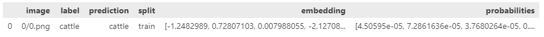

<p align="center"><a href="https://spotlight.renumics.com"></a></p>
<h1 align="center">Renumics Spotlight</h1>
<p align="center">Interactively explore unstructured datasets from your dataframe.</p>

<p align="center">
	<a href="https://github.com/Renumics/spotlight/blob/main/LICENSE"></a>
 	<a href="https://pypi.org/project/renumics-spotlight/"></a>
 	<a href="https://pypi.org/project/renumics-spotlight/"></a>
</p>

  <h3 align="center">
   <a href="https://spotlight.renumics.com"><b>Documentation</b></a> &bull;
   <a href="https://renumics.com/docs/playbook"><b>Playbook</b></a> &bull;
   <a href="https://renumics.com/blog/"><b>Blog</b></a> &bull;
   <a href="https://renumics.com/api/spotlight/"><b>API Reference</b></a>
 </h3>

<p align="center"><a href="https://spotlight.renumics.com"></a></p>

Spotlight helps you to **understand unstructured datasets** fast. You can quickly create **interactive visualizations** and leverage data enrichments (e.g. embeddings, prediction, uncertainties) to **identify critical clusters** in your data.

Spotlight supports most unstructured data types including **images, audio, text, videos, time-series and geometric data**. You can start from your existing dataframe:

<p align="left"></a></p>

And start Spotlight with just a few lines of code:

```python
from renumics import spotlight

spotlight.show(df, dtype={"image": spotlight.Image, "embedding": spotlight.Embedding})
```

## 🚀 Start with a use case

Machine learning and engineering teams use Spotlight to understand and communicate on complex unstructured data problems. Here are some examples on publicly available datasets along with code snippets (👨‍💻), interactive demos (🕹️) and blog articles (📝):

<table>
    <thead>
        <tr>
            <th>Modality</th>
	    <th>Task</th>
            <th>Description</th>
            <th>Link</th>
        </tr>
    </thead>
    <tbody>
        <tr>
            <td rowspan="3">🖼️ Image</td>
	    <td rowspan="3">[Classification]</td>
            <td>Find Issues in Any Image Classification Dataset</td>
            <td><a href="https://www.renumics.com/next/docs/use-cases/image-classification">👨‍💻</a> <a href="https://medium.com/@daniel-klitzke/finding-problematic-data-slices-in-unstructured-data-aeec0a3b9a2a">📝</a> <a href="https://huggingface.co/spaces/renumics/sliceguard-unstructured-data">🕹️</a></td>
        </tr>
        <tr>
            <td>Find data issues in the CIFAR-100 image dataset</td>
            <td><a href="https://huggingface.co/spaces/renumics/navigate-data-issues">🕹️</a></td>
        </tr>
        <tr>
            <td>Fine-tuning image classification models from Bing image search</td>
            <td><a href="https://renumics.com/next/docs/use-cases/image-fine-tuning">👨‍💻</a><a href="https://medium.com/@markus.stoll/image-classification-in-2023-8ab7dc552115">📝</a></td>
        </tr>
        <tr>
            <td rowspan="3">🔊 Audio</td>
	    <td rowspan="3">[Classification]</td>
            <td>Find Issues in Any Audio Classification Dataset</td>
            <td><a href="https://www.renumics.com/next/docs/use-cases/audio-classification">👨‍💻</a> <a href="https://medium.com/@daniel-klitzke/finding-problematic-data-slices-in-unstructured-data-aeec0a3b9a2a">📝</a><a href="https://huggingface.co/spaces/renumics/whisper-commonvoice-speaker-issues">🕹️</a></td>
        </tr>
        <tr>
            <td>Debug pre-trained gender detection models on the emodb dataset</td>
            <td><a href="https://medium.com/p/dbfd923a5a79#432e-3559ae606f80">📝</a> <a href="https://huggingface.co/spaces/renumics/emodb-model-debugging">🕹️</a></td>
        </tr>
        <tr>
            <td>Compare gender detection models on the emodb dataset</td>
            <td><a href="https://medium.com/p/dbfd923a5a79#432e-3559ae606f80">📝</a> <a href="https://huggingface.co/spaces/renumics/emodb-model-comparison">🕹️</a></td>
        </tr>
        <tr>
            <td rowspan="1">📝 Text</td>
	    <td rowspan="1">[Classification]</td>
            <td>Find Issues in Any Text Classification Dataset</td>
            <td><a href="https://www.renumics.com/next/docs/use-cases/text-classification">👨‍💻</a> <a href="https://medium.com/@daniel-klitzke/finding-problematic-data-slices-in-unstructured-data-aeec0a3b9a2a">📝</a></td>
        </tr>
        <tr>
            <td rowspan="2">📈🖼️ Mixed</td>
	    <td rowspan="2">[EDA]</td>
            <td>Explore results from the Formula1 Montreal 2023 GP</td>
            <td><a href="https://huggingface.co/spaces/renumics/f1_montreal_gp">🕹️</a></td>
        </tr>
        <tr>
            <td>Explore a crash simulation dataset</td>
            <td><a href="https://huggingface.co/spaces/renumics/crash-simulation-demo">🕹️</a></td>
        </tr>
    </tbody>
</table>

## ⏱️ Quickstart

Get started by installing Spotlight and loading your first dataset.

#### What you'll need

-   [Python](https://www.python.org/downloads/) version 3.8-3.11

#### Install Spotlight via [pip](https://packaging.python.org/en/latest/key_projects/#pip)

```bash
pip install renumics-spotlight
```

> We recommend installing Spotlight and everything you need to work on your data in a separate [virtual environment](https://docs.python.org/3/tutorial/venv.html).

#### Load a dataset and start exploring

```python
import pandas as pd
from renumics import spotlight

df = pd.read_csv("https://renumics.com/data/mnist/mnist-tiny.csv")
spotlight.show(df, dtype={"image": spotlight.Image})
```

`pd.read_csv` loads a sample csv file as a pandas [DataFrame](https://pandas.pydata.org/docs/reference/api/pandas.DataFrame.html).

`spotlight.show` opens up spotlight in the browser with the pandas dataframe ready for you to explore. The `dtype` argument specifies custom column types for the browser viewer.

#### Load a [Hugging Face](https://huggingface.co/) audio dataset with embeddings and a pre-defined layout

```python
import datasets
from renumics import spotlight

ds = datasets.load_dataset('renumics/emodb-enriched', split='all')
layout= spotlight.layouts.debug_classification(label='gender', prediction='m1_gender_prediction', embedding='m1_embedding', features=['age', 'emotion'])
spotlight.show(ds, layout=layout)
```

Here, the data types are discovered automatically from the dataset and we use a pre-defined layout for model debugging. Custom layouts can be built programmatically or via the UI.

> The `datasets[audio]` package can be installed via pip.

#### Usage Tracking

We have added crash report and performance collection. We do NOT collect user data other than an anonymized Machine Id obtained by py-machineid, and only log our own actions. We do NOT collect folder names, dataset names, or row data of any kind only aggregate performance statistics like total time of a table_load, crash data, etc. Collecting Spotlight crashes will help us improve stability. To opt out of the crash report collection define an environment variable called `SPOTLIGHT_OPT_OUT` and set it to true. e.G.`export SPOTLIGHT_OPT_OUT=true`

## We are very happy to hear your feedback

-   Open an issue on [Github](https://github.com/renumics)
-   Have a [coffee talk](https://calendly.com/stefan-suwelack/dcai-intro-30-min) with us
-   Join our channel on [Discord](https://discord.gg/VAQdFCU5YD)

## Learn more about unstructured data workflows

-   🤗 [Huggingface](https://huggingface.co/renumics) example spaces and datasets
-   🏀 [Playbook](https://renumics.com/docs/data-centric-ai/playbook) for data-centric AI workflows
-   🍰 [Sliceguard](https://github.com/Renumics/sliceguard) library for automatic slice detection

## Contribute

We are currently participating in the running [Hacktoberfest 2023](https://hacktoberfest.com/).

If you would like to contribute to Spotlight, the easiest way is to have a look at our [Contribution Docs](https://renumics.com/docs/development) and the [CONTRIBUTING.md](./CONTRIBUTING.md).

We are also equally happy about non-code contributions -- whether it's reporting bugs, suggesting features, contributing design ideas, or offering feedback, every non-code contribution is highly valued and helps make our project better for everyone.
