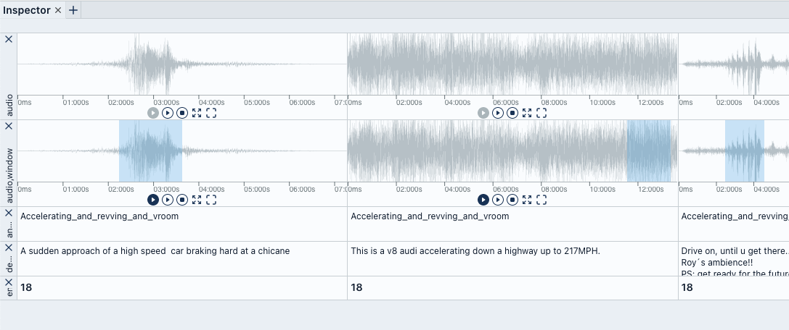
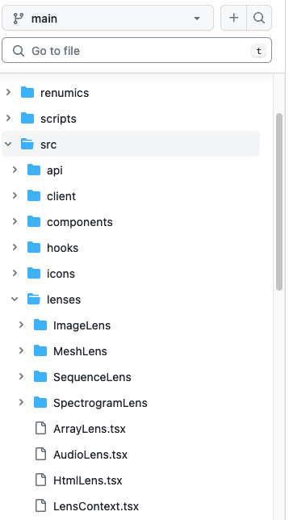
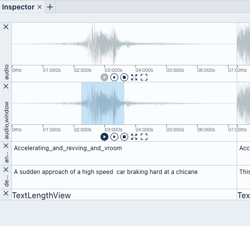

Time to write your first custom Lens.<br />
For the purpose of this example we will create a Lens that shows the length of the cells text.



## Have a look at existing Lenses

The easiest way to get started is to have a look at the existing Lenses and see how they are implemented.<br />
An Inspector Lens is basically a [React Component](https://www.w3schools.com/react/react_components.asp) and
like the rest of spotlights frontend written in typescript and stored in `src/lenses`.



## Add a new Lens

In order to add a new Lens to spotlight two actions are required:

1. Add the Lens into the [`src/lenses`](https://github.com/Renumics/spotlight/blob/main/src/lenses)
   folder and specify the relevant metadata.
2. Register the Lens in the
   [`src/lenses/index.ts`](https://github.com/Renumics/spotlight/blob/main/src/lenses/index.ts) file.

### Create a new Lens

We will call the Lens `TextLengthLens` and create a new file `src/lenses/TextLengthLens.tsx`.

```tsx title="src/lenses/TextLengthLens.tsx"
import { Lens } from "../types";

const TextLengthLens: Lens = () => {
    return <>TextLengthView</>;
};

TextLengthLens.key = "TextLengthView";
TextLengthLens.dataTypes = [
    "int",
    "float",
    "bool",
    "str",
    "datetime",
    "Category",
];
TextLengthLens.defaultHeight = 22;
TextLengthLens.minHeight = 22;
TextLengthLens.maxHeight = 64;
TextLengthLens.displayName = "Text Length";

export default TextLengthLens;
```

The Lens is a React Component that returns JSX. The JSX can be as simple or complex as you want.<br />
The Lens also needs to specify some metadata:

-   **key**: A unique key for the Lens.
-   **dataTypes**: The data types that the Lens can handle.
    Have a look at [`src/datatypes.ts`](https://github.com/Renumics/spotlight/blob/main/src/datatypes.ts)
    for a list of all data types.
-   **defaultHeight**: The default height of the Lens.
-   **minHeight**: The minimum height of the Lens.
-   **maxHeight**: The maximum height of the Lens.
-   **displayName**: The name that will be displayed in the Lens selection dropdown.
-   **multi**: Can the Lens handle multiple columns. (E.G. [AudioLens](https://github.com/Renumics/spotlight/blob/main/src/lenses/AudioLens.tsx)
-   **filterAllowedColumns**: Select columns that can be added to already selected columns. (E.G. [AudioLens](https://github.com/Renumics/spotlight/blob/main/src/lenses/AudioLens.tsx)
-   **isSatisfied**: Is the Lens ready to be displayed. (E.G. [AudioLens](https://github.com/Renumics/spotlight/blob/main/src/lenses/AudioLens.tsx)

In order for spotlight to know that there is a new Lens, add it to `ALL_LENSES` in
[`src/lenses/index.ts`](https://github.com/Renumics/spotlight/blob/main/src/lenses/index.ts)

```tsx title="src/lenses/index.ts"
...
import TextLengthLens from './TextLengthLens';

export const ALL_LENSES = [
    ...
    TextLengthLens,
];
```

Finally refresh spotlight and you should see the new Lens in the dropdown.<br />
Add it to the inspector and you should see the `TextLengthView` text.



### Use Cell Value

The `TextLengthView` text is not very useful. Lets change it to interact with the cells value.

A Lens Component gets instantiated by the [`LensFactory`](https://github.com/Renumics/spotlight/blob/main/src/lenses/LensFactory.tsx)
and recieves [`LensProps`](https://github.com/Renumics/spotlight/blob/main/src/types/lenses.ts) as props value.

In this tutorial we will only use the `value` but via the props a Lens also has access
to the column it is instantiated for, the rowIndex of the current cell and
an url to load the cell value from the backend
in case the datatype requires additional data from the backend
(e.G. an Image in the [ImageLens](https://github.com/Renumics/spotlight/blob/main/src/lenses/ImageLens/index.ts)).

Update the `TextLengthLens` to use the `value` prop.

```tsx title="src/lenses/TextLengthLens.tsx"
...
const TextLengthLens: Lens = ({ value }) => {
    return <>{`${value}`.length}</>;
};
...
```

Verify that instead of the text, the length of the text is displayed.

### Style the Cell

In order to style components spotlight uses [tailwindcss](https://tailwindcss.com/)
in combination with [twin.macro](https://github.com/ben-rogerson/twin.macro).

In order to use twin.macro in your component you have to import it and add tailwindcss utility classes
to the `tw` prop of your tsx elements.

We wont get fancy in this example so lets just style the font and add a little padding.

```tsx title="src/lenses/TextLengthLens.tsx"
import 'twin.macro';
import { Lens } from '../types';

const TextLengthLens: Lens = ({ value }) => {
    return <div tw="text-sm font-semibold px-1 py-1">{`${value}`.length}</div>;
};
...
```

### What else

Besides simply displaying values it is also possible to add more functionality to a Lens
e.G. via a settings menu or by syncing Lenses across rows.

If you are interested in additional functionality simply have a look at other
[lenses](https://github.com/Renumics/spotlight/blob/main/src/lenses) that are already implemented
or get in touch with us on [Github](https://github.com/Renumics/spotlight) or [Discord](https://discord.gg/VAQdFCU5YD).
