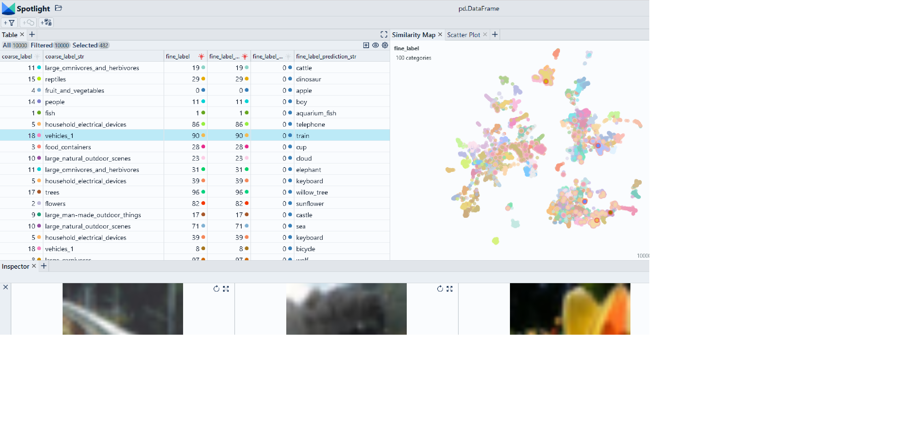

# Create image embeddings with Towhee

We use the [towhee library](https://github.com/towhee-io/towhee) to create an embedding for a an image dataset.

> Use Chrome to run Spotlight in Colab. Due to Colab restrictions (e.g. no websocket support), the performance is limited. Run the notebook locally for the full Spotlight experience.

[Open In Colab](https://colab.research.google.com/github/Renumics/spotlight/blob/main/playbook/rookie/towhee_embedding.ipynb)

=== "inputs"

    -   `df['image']` contains the paths to the [images](../glossary/index.md#image-data) in the dataset

=== "outputs"

    -   `df['embeddings']` contain the image [embeddings](../glossary/index.md#embedding) for each data sample

=== "parameters"

    -   `modelname` designates the pre-trained model used to compute the embedding. You can find many more available models on the [towhee operator hub](https://towhee.io/tasks/operator).



## Imports and play as copy-n-paste functions

??? note "# Install dependencies"

    ```python
    # Imports
    !pip install renumics-spotlight towhee datasets
    ```

??? note "#Play as copy-n-paste functions"

    ```python

    # @title Play as copy-n-paste functions

    import datasets
    from towhee import pipe, ops
    from renumics import spotlight
    import pandas as pd
    import requests
    import json

    def towhee_embedding(
        df,
        modelname="beit_base_patch16_224",
        image_name="image",
    ):

        p = (
        pipe.input('path')
            .map('path', 'img', ops.image_decode())
            .map('img', 'vec', ops.image_embedding.timm(model_name=modelname))
            .output('vec')
        )

        data = df[image_name].tolist()

        dc_embedding = p.batch(data)

        df_emb = pd.DataFrame()
        # towhee returns a list, we get the first (and only) element
        df_emb["embedding"] = [x.get()[0] for x in dc_embedding]

        return df_emb

    ```

## Step-by-step example on CIFAR-100

### Load CIFAR-100 from Huggingface hub and convert it to Pandas dataframe

```python
dataset = datasets.load_dataset("renumics/cifar100-enriched", split="train")
df = dataset.to_pandas()
```

### Compute embedding with vision transformer from Huggingface

```python
df_emb=towhee_embedding(df, modelname='tbeit_base_patch16_224')
df = pd.concat([df, df_emb], axis=1)
```

### Reduce embeddings for faster visualization

```python
import umap
import numpy as np
embeddings = np.stack(df['embedding'].to_numpy())
reducer = umap.UMAP()
reduced_embedding = reducer.fit_transform(embeddings)
df['embedding_reduced'] = np.array(reduced_embedding).tolist()
```

### Perform EDA with Spotlight

```python
df_show = df.drop(columns=['embedding', 'probabilities'])
spotlight.show(df_show, port=port, dtype={"image": spotlight.Image, "embedding_reduced": spotlight.Embedding})

```
