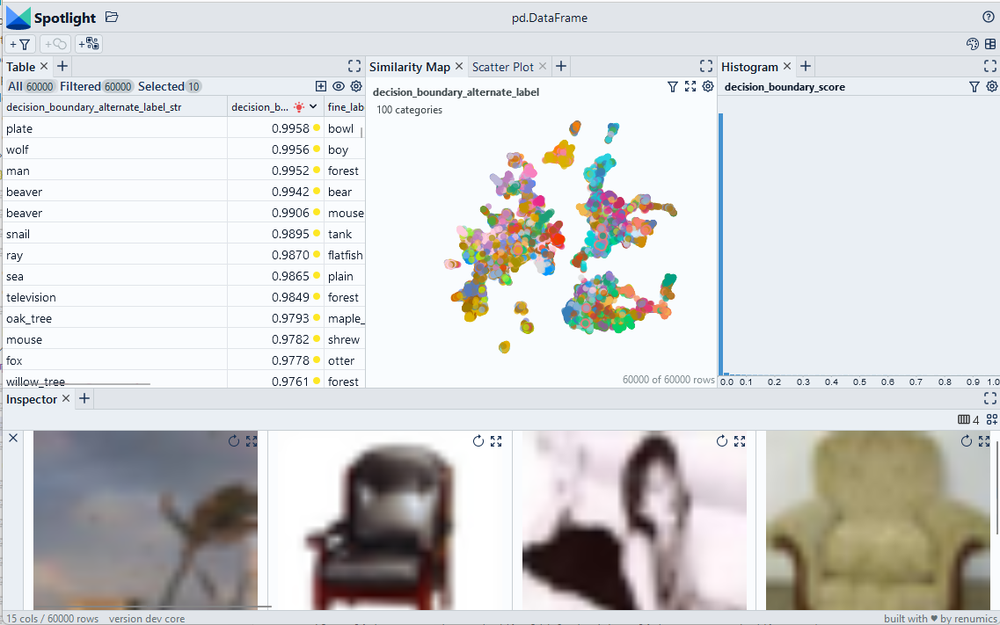

# Detect decision boundaries based on certainty ratios

We use certainty ratios to compute a decision boundary score.

> Use Chrome to run Spotlight in Colab. Due to Colab restrictions (e.g. no websocket support), the performance is limited. Run the notebook locally for the full Spotlight experience.

[Open In Colab](https://colab.research.google.com/github/Renumics/spotlight/blob/main/playbook/rookie/decision_boundary_detection.ipynb)

=== "inputs"

    -   `df['probabilities']` contain the [class probability vector](../glossary/index.md#probabilities) that was inferred by the model

=== "outputs"

    -   `df['decision_boundary_score']` contains a score between 0 and 1 that indicates how close the data sample is to the [decision boundary](../glossary/index.md#decision-boundary). 1 means the data sample is on the decision boundary, 0 means it is far away.

=== "parameters"



## Imports and play as copy-n-paste functions

??? note "# Install dependencies"

    ```python
    #@title Install required packages with PIP

    !pip install renumics-spotlight datasets
    ```

??? note "# Play as copy-n-paste functions"

    ```python
    import datasets
    import numpy as np
    import pandas as pd
    from renumics import spotlight
    import requests

    def boundary_score(df, probabilities_name='probabilities'):
        def compute_score(probs):
            indices=np.argsort(probs)[::-1]
            score = [indices[0], indices[1], probs[indices[0]],probs[indices[1]] ]

            return score

        df_out=pd.DataFrame()
        temp_scores=[compute_score(x) for x in df[probabilities_name]]
        df_out['decision_boundary_score']=[x[3]/x[2] for x in temp_scores]
        df_out['decision_boundary_alternate_label']=[x[1] for x in temp_scores]

        return df_out
    ```

## Step-by-step example on CIFAR-100

### Load CIFAR-100 from Huggingface hub and convert it to Pandas dataframe

```python
dataset = datasets.load_dataset("renumics/cifar100-enriched", split="train")
df = dataset.to_pandas()
```

### Compute decision boundary score and alternate label

```python
f_boundary = boundary_score(df)
df = pd.concat([df, df_boundary], axis=1)
df['decision_boundary_alternate_label_str']=[dataset.features["fine_label"].int2str(x) for x in df['decision_boundary_alternate_label']]
```

### Inspect decision boundary with Spotlight

```python
df_show = df.drop(columns=['embedding', 'probabilities'])
layout_url = "https://raw.githubusercontent.com/Renumics/spotlight/playbook/playbook/rookie/decision_boundary_layout.json"
response = requests.get(layout_url)
layout = spotlight.layout.nodes.Layout(**json.loads(response.text))
spotlight.show(df_show, dtype={"image": spotlight.Image, "embedding_reduced": spotlight.Embedding}, layout=layout)
```
