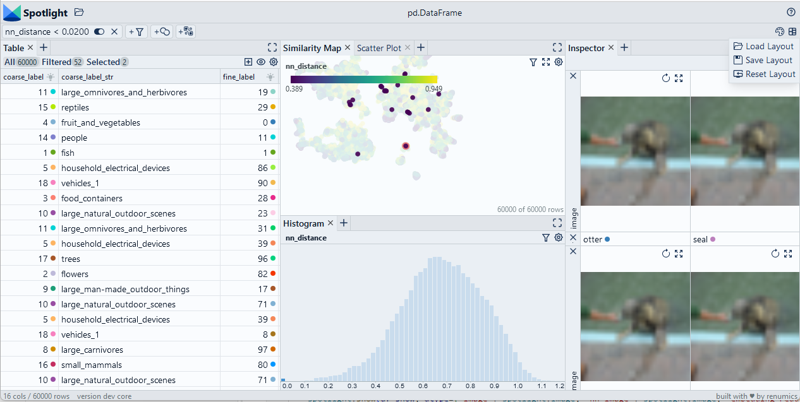

# Detect duplicates with Annoy

We use embeddings to detect duplicates by computing nearest neighbors with the Annoy library. Although the example is based on image embeddings, the basic play is independent of the data type.

> Use Chrome to run Spotlight in Colab. Due to Colab restrictions (e.g. no websocket support), the performance is limited. Run the notebook locally for the full Spotlight experience.

<a
    target="_blank"
    href="https://colab.research.google.com/github/Renumics/spotlight/blob/main/playbook/veteran/duplicates_annoy.ipynb"
>
    
</a>

=== "inputs"

    -   `df['embedding']` contain the [embeddings](../glossary/index.md#embedding) for each data sample

=== "outputs"

    -   `df['nn_id']` contains the sample id for the [nearest neighbor](../glossary/index.md#nearest-neighbor-k-th-nearest-neighbor) in the embedding space.
    -   `df['nn_image']` contains the path to the [image](../glossary/index.md#image-data) that is the nearest neighbor.
    -   `df['nn_distance']` contains distance to the nearest neighbor.
    -   `df['nn_flag']` contains a flag that indicates if the sample is a near-duplicate according to the given threshold.

=== "parameters"

    * `threshold` denotes the distance threshold when a data sample is considered a near-duplicate.
    * `tree_size` is an internal parameter for the Annoy library that calibrates the speed-efficiency tradeoff. More trees gives higher precision when querying.



## Imports and play as copy-n-paste functions

??? note "# Install dependencies"

    ```python
    #@title Install required packages with PIP

    !pip install renumics-spotlight datasets annoy
    ```

??? note "# Play as copy-n-paste functions"

    ```python
    #@title Play as copy-n-paste functions

    import datasets
    from renumics import spotlight
    from annoy import AnnoyIndex
    import pandas as pd
    import requests

    def nearest_neighbor_annoy(df, embedding_name='embedding', threshold=0.3, tree_size=100):

        embs = df[embedding_name]

        t = AnnoyIndex(len(embs[0]), 'angular')

        for idx, x in enumerate(embs):
              t.add_item(idx, x)

        t.build(tree_size)

        images = df['image']

        df_nn = pd.DataFrame()

        nn_id = [t.get_nns_by_item(i,2)[1] for i in range(len(embs))]
        df_nn['nn_id'] = nn_id
        df_nn['nn_image'] = [images[i] for i in nn_id]
        df_nn['nn_distance'] = [t.get_distance(i, nn_id[i]) for i in range(len(embs))]
        df_nn['nn_flag'] = (df_nn.nn_distance < threshold)

        return df_nn
    ```

## Step-by-step example on CIFAR-100

### Load CIFAR-100 from Huggingface hub and convert it to Pandas dataframe

```python
dataset = datasets.load_dataset("renumics/cifar100-enriched", split="train")
df = dataset.to_pandas()
```

### Compute nearest neighbors including distances

```python
df_nn = nearest_neighbor_annoy(df)
df = pd.concat([df, df_nn], axis=1)
```

### Inspect and remove duplicates with Spotlight

```python
df_show = df.drop(columns=['embedding', 'probabilities'])
layout_url = "https://raw.githubusercontent.com/Renumics/spotlight/playbook_initial_draft/playbook/rookie/duplicates_annoy.json"
response = requests.get(layout_url)
layout = spotlight.layout.nodes.Layout(**json.loads(response.text))
spotlight.show(df_show, dtype={"image": spotlight.Image, "embedding_reduced": spotlight.Embedding}, layout=layout)
```
