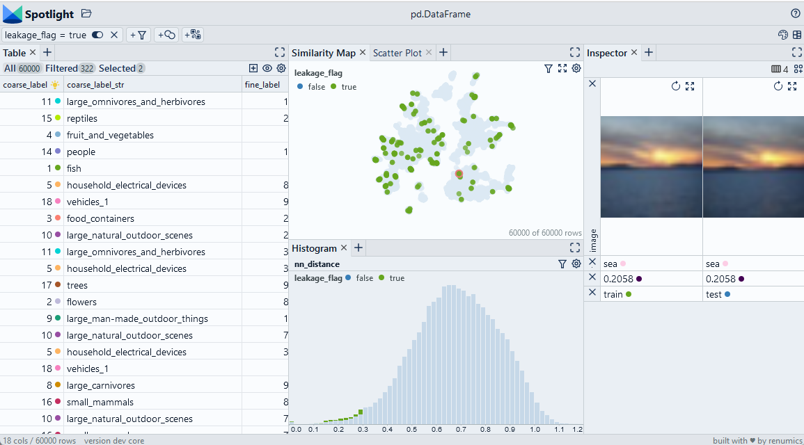

# Detect leakage with Annoy

We use embeddings to detect duplicates by computing nearest neighbors with the Annoy library. Then, we analyse those examples that leak from the training to the validation split. Although the example is based on image embeddings, the basic play is independent of the data type.

> Use Chrome to run Spotlight in Colab. Due to Colab restrictions (e.g. no websocket support), the performance is limited. Run the notebook locally for the full Spotlight experience.

[Open In Colab](https://colab.research.google.com/github/Renumics/spotlight/blob/main/playbook/veteran/leakage_annoy.ipynb)

=== "inputs"

    -   `df['nn_id']` contains the sample id for the [nearest neighbor](../glossary/index.md#nearest-neighbor-k-th-nearest-neighbor) in the embedding space.
    -   `df['split']` contains the name or numeric id for the split for each data sample.
    -   `df['nn_distance']` contains distance to the nearest neighbor.

=== "outputs"

    -   `df_leak['nn_same_split']` contains a boolean flag if the data sample and its nearest neighbor is in the same split.
    -   `df_leak['leakage_flag']` contains a boolean flag if the the data sample is a candidate for leakage.

=== "parameters"

    * `threshold` denotes the distance threshold when a data sample is considered a near-duplicate.



## Imports and play as copy-n-paste functions

??? note "# Install dependencies"

    ```python
    #@title Install required packages with PIP

    !pip install renumics-spotlight datasets annoy
    ```

??? note "# Play as copy-n-paste functions"

    ```python
    #@title Play as copy-n-paste functions

    import datasets
    from renumics import spotlight
    from annoy import AnnoyIndex
    import pandas as pd
    import requests

    def nearest_neighbor_annoy(df, embedding_name='embedding', threshold=0.3, tree_size=100):

        embs = df[embedding_name]

        t = AnnoyIndex(len(embs[0]), 'angular')

        for idx, x in enumerate(embs):
              t.add_item(idx, x)

        t.build(tree_size)

        images = df['image']

        df_nn = pd.DataFrame()

        nn_id = [t.get_nns_by_item(i,2)[1] for i in range(len(embs))]
        df_nn['nn_id'] = nn_id
        df_nn['nn_image'] = [images[i] for i in nn_id]
        df_nn['nn_distance'] = [t.get_distance(i, nn_id[i]) for i in range(len(embs))]
        df_nn['nn_flag'] = (df_nn.nn_distance < threshold)

        return df_nn

    def detect_leakage(df, nn_id_name='nn_id', split_name='split', threshold=0.3):
        nn_id = df['nn_id']
        split = split = df['split']

        df_leak = pd.DataFrame()
        df_leak['nn_same_split'] = [True if split[i]==split[nn_id[i]] else False for i in range(len(nn_id))]
        df_leak['leakage_flag'] = (df.nn_distance < 0.3) & (df_leak['nn_same_split'] != True )

        return df_leak
    ```

## Step-by-step example on CIFAR-100

### Load CIFAR-100 from Huggingface hub and convert it to Pandas dataframe

```python
dataset = datasets.load_dataset("renumics/cifar100-enriched", split="train")
df = dataset.to_pandas()
```

### Compute heuristics for data leakage based on nearest neighbor distance

```python
df_nn = nearest_neighbor_annoy(df)
df = pd.concat([df, df_nn], axis=1)
df_leak = detect_leakage(df)
df = pd.concat([df, df_leak], axis=1)
```

### Inspect and remove leakage with Spotlight

```python
df_show = df.drop(columns=['embedding', 'probabilities'])
layout_url = "https://raw.githubusercontent.com/Renumics/spotlight/main/playbook/veteran/leakage_annoy.json"
response = requests.get(layout_url)
layout = spotlight.layout.nodes.Layout(**json.loads(response.text))
spotlight.show(df_show, dtype={"image": spotlight.Image, "embedding_reduced": spotlight.Embedding}, layout=layout)
```
