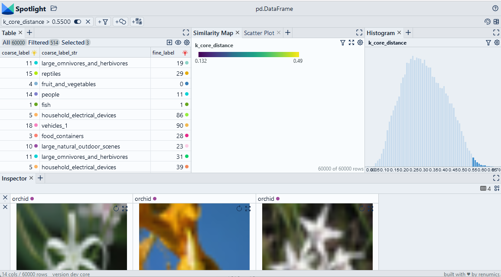

# Detect data drift with the k-core distance

We compute the cosine distance of the k-nearest neighbor in the embedding space for each data sample. This distance can be used to detect outliers/drifted samples. We find a suitable outlier threshold by inspecting the data with Spotlight.

> Use Chrome to run Spotlight in Colab. Due to Colab restrictions (e.g. no websocket support), the performance is limited. Run the notebook locally for the full Spotlight experience.

[Open In Colab](https://colab.research.google.com/github/Renumics/spotlight/blob/main/playbook/veteran/drift_kcore.ipynb)

=== "inputs"

    -   `df['embedding']` contain the [embeddings](../glossary/index.md#embedding) for each data sample

=== "outputs"

    -   `df_leak['k_core_distance']` contains the cosine distance to the [k-th neighbor](../glossary/index.md#nearest-neighbor-k-th-nearest-neighbor) of the data sample
    -   `df_leak['k_core_index']` contains the index to the [k-th neighbor](../glossary/index.md#nearest-neighbor-k-th-nearest-neighbor) of the data sample

=== "parameters"

    * `k` denotes the k-th neighbor to which the distance is measured.



## Imports and play as copy-n-paste functions

??? note "# Install dependencies"

    ```python
    #@title Install required packages with PIP

    !pip install renumics-spotlight datasets
    ```

??? note "# Play as copy-n-paste functions"

    ```python
    #@title Play as copy-n-paste functions

    from sklearn.neighbors import NearestNeighbors
    import pandas as pd
    import numpy as np
    import datasets
    from renumics import spotlight

    def compute_k_core_distances(df, k=8, embedding_name='embedding'):
        features = np.stack(df[embedding_name].to_numpy())
        neigh = NearestNeighbors(n_neighbors=k, metric='cosine')
        neigh.fit(features)
        distances, indices = neigh.kneighbors()

        df_out=pd.DataFrame()
        df_out['k_core_distance']=distances[:,-1]
        df_out['k_core_index']=indices[:, -1]

        return df_out
    ```

## Step-by-step example on CIFAR-100

### Load CIFAR-100 from Huggingface hub and convert it to Pandas dataframe

```python
dataset = datasets.load_dataset("renumics/cifar100-enriched", split="train")
df = dataset.to_pandas()
```

### Compute k-nearest neighbor distances

```python
df_kcore = compute_k_core_distances(df)
df = pd.concat([df, df_kcore], axis=1)
```

### Inspect candidates for data drift with Spotlight

```python
df_show = df.drop(columns=['embedding', 'probabilities'])
layout_url = "https://raw.githubusercontent.com/Renumics/spotlight/main/playbook/veteran/leakage_annoy.json"
response = requests.get(layout_url)
layout = spotlight.layout.nodes.Layout(**json.loads(response.text))
spotlight.show(df_show, dtype={"image": spotlight.Image, "embedding_reduced": spotlight.Embedding}, layout=layout)
```
