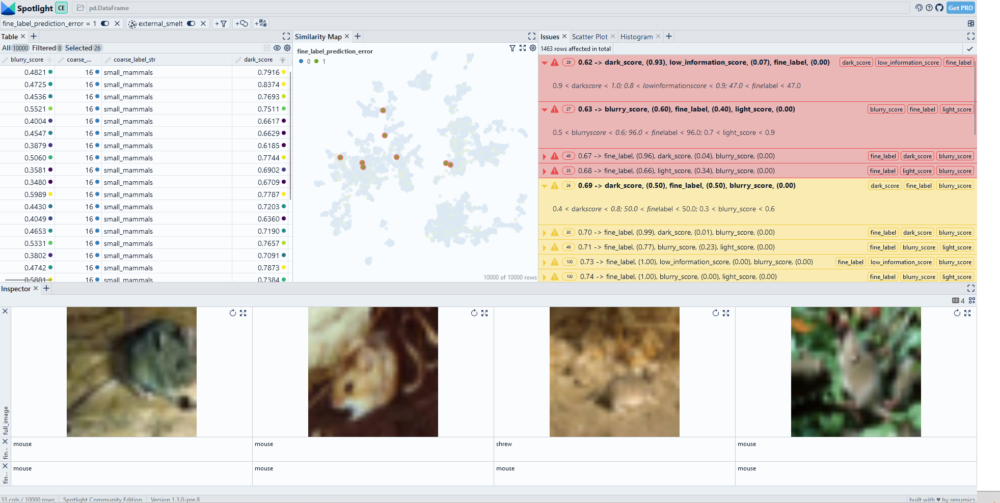

# Find data slices with Sliceguard

We use [Sliceguard](https://github.com/Renumics/sliceguard) to identify data segments where our machine learning model performs anomalously (data slices). We interactively explore these data slices to find model failure modes and problematic data segments.

> Use Chrome to run Spotlight in Colab. Due to Colab restrictions (e.g. no websocket support), the performance is limited. Run the notebook locally for the full Spotlight experience.

<a
    target="_blank"
    href="https://colab.research.google.com/github/Renumics/spotlight/blob/main/playbook/allstar/data-slices-sliceguard.ipynb"
>
    
</a>

=== "inputs"

    -   `categories` contains contain the names of the [features](../glossary/index.md#features) and [metadata](../glossary/index.md#metadata) columns that are to be analyzed
    -   `df['label']` contains the [label](../glossary/index.md#label) for each data sample
    -   `df['prediction']` contains the [prediction](../glossary/index.md#label) for each data sample
    -   `df['embedding']` contains the [embeddings](../glossary/index.md#embedding) for each data sample (optional)

=== "outputs"

    -   `df_slices contains a dataframe with a description of the issues found

=== "parameters"

    * `category_types` (optional) describes the type of the features and metadata ("raw", "nominal", "ordinal", "numerical", "embedding").
    * `spotlight_dtype` (optional) describes data types for the visualization with Spotlight.



## Imports and play as copy-n-paste functions

??? note "# Install dependencies"

    ```python
    #@title Install required packages with PIP

    !pip install renumics-spotlight sliceguard datasets cleanvision
    ```

??? note "Play as copy-n-paste functions"

    ```python
    #@title Play as copy-n-paste snippet

    from sklearn.metrics import accuracy_score
    import pandas as pd
    import datasets
    from renumics.spotlight import Image
    from sliceguard import SliceGuard
    from cleanvision.imagelab import Imagelab

    def find_data_slices(df, categories, category_types={}, spotlight_dtype={}, embedding_name='embedding', label_name='label', prediction_name='prediction'):
        sg = SliceGuard()
        df_slices = sg.find_issues(
            df,
            categories,
            label_name,
            prediction_name,
            accuracy_score,
            precomputed_embeddings = {'embedding': df[embedding_name].to_numpy()},
            metric_mode="max",
            feature_types=category_types
        )

        sg.report(spotlight_dtype=spotlight_dtype)

        return df_slices
    ```

## Step-by-step example on CIFAR-100

### Load CIFAR-100 from Huggingface hub and convert it to Pandas dataframe

```python
dataset = datasets.load_dataset("renumics/cifar100-enriched", split="test")
df = dataset.to_pandas()
```

### Enrich dataset with metadata using [Cleanvision](./cv_issues.md)

```python
def cv_issues_cleanvision(df, image_name='image'):

    image_paths = df['image'].to_list()
    imagelab = Imagelab(filepaths=image_paths)
    imagelab.find_issues()

    df_cv=imagelab.issues.reset_index()

    return df_cv

df_cv = cv_issues_cleanvision(df)
df = pd.concat([df, df_cv], axis=1)
```

### Identify and explore data slices with Sliceguard

```python
categories=['dark_score', 'low_information_score', 'light_score', 'blurry_score', 'fine_label']
prediction = 'fine_label_prediction'
label = 'fine_label'
category_types={'fine_label': 'nominal'}
spotlight_dtype={"image": Image}

find_data_slices(df, categories, category_types=category_types, spotlight_dtype=spotlight_dtype, embedding_name='embedding', label_name=label, prediction_name=prediction)

```
