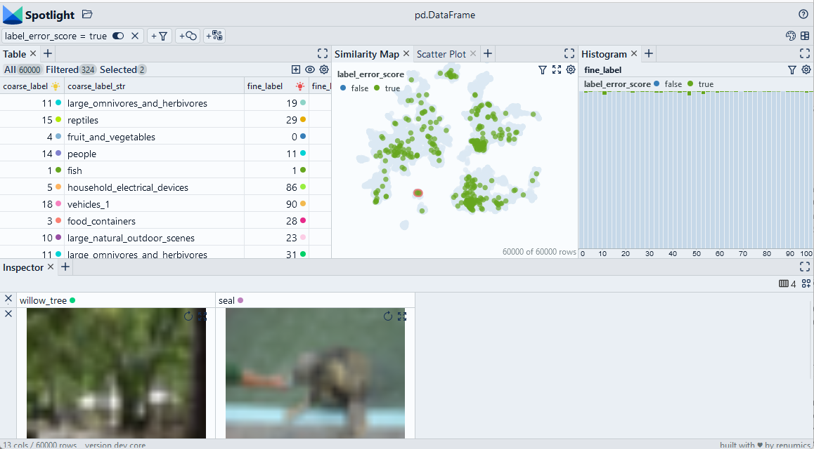

# Find false labels with Cleanlab

We use the [Cleanlab library](https://github.com/cleanlab/cleanlab) to compute label error scores. We then manually inspect the data points to correct them.

> Use Chrome to run Spotlight in Colab. Due to Colab restrictions (e.g. no websocket support), the performance is limited. Run the notebook locally for the full Spotlight experience.

[Open In Colab](https://colab.research.google.com/github/Renumics/spotlight/blob/main/playbook/veteran/label_errors_cleanlab.ipynb)

=== "inputs"

    -   `df['label']` contains the [label](../glossary/index.md#label) for each data sample
    -   `df['probabilities']` contains the [class probability vector](../glossary/index.md#probabilities) that was inferred by the model

=== "outputs"

    -   `df_leak['label_error_score']` contains a boolean flag that indicates a data sample with a [label](../glossary/index.md#label) error

=== "parameters"



## Imports and play as copy-n-paste functions

??? note "# Install dependencies"

    ```python
    #@title Install required packages with PIP

    !pip install renumics-spotlight cleanlab datasets
    ```

??? note "# Play as copy-n-paste functions"

    ```python
    #@title Play as copy-n-paste functions

    import datasets
    from renumics import spotlight
    from cleanlab.filter import find_label_issues
    import numpy as np
    import pandas as pd

    def label_error_score_cleanlab(df, probabilities_name='probabilities', label_name='labels'):

        probs = np.stack(df[probabilities_name].to_numpy())
        labels = df[label_name].to_numpy()

        label_issues = find_label_issues(labels, probs)

        df_out=pd.DataFrame()
        df_out['label_error_score']=label_issues

        return df_out
    ```

## Step-by-step example on CIFAR-100

### Load CIFAR-100 from Huggingface hub and convert it to Pandas dataframe

```python
dataset = datasets.load_dataset("renumics/cifar100-enriched", split="train")
df = dataset.to_pandas()
```

### Compute label error scores with Cleanlab

```python
df_le = label_error_score_cleanlab(df, label_name='fine_label')
df = pd.concat([df, df_le], axis=1)
```

### Inspect label errors and remove them with Spotlight

```python
df_show = df.drop(columns=['embedding', 'probabilities'])
layout_url = "https://raw.githubusercontent.com/Renumics/spotlight/main/playbook/veteran/label_errors_cleanlab.json"
response = requests.get(layout_url)
layout = spotlight.layout.nodes.Layout(**json.loads(response.text))
spotlight.show(df_show, dtype={"image": spotlight.Image, "embedding_reduced": spotlight.Embedding}, layout=layout)
```
