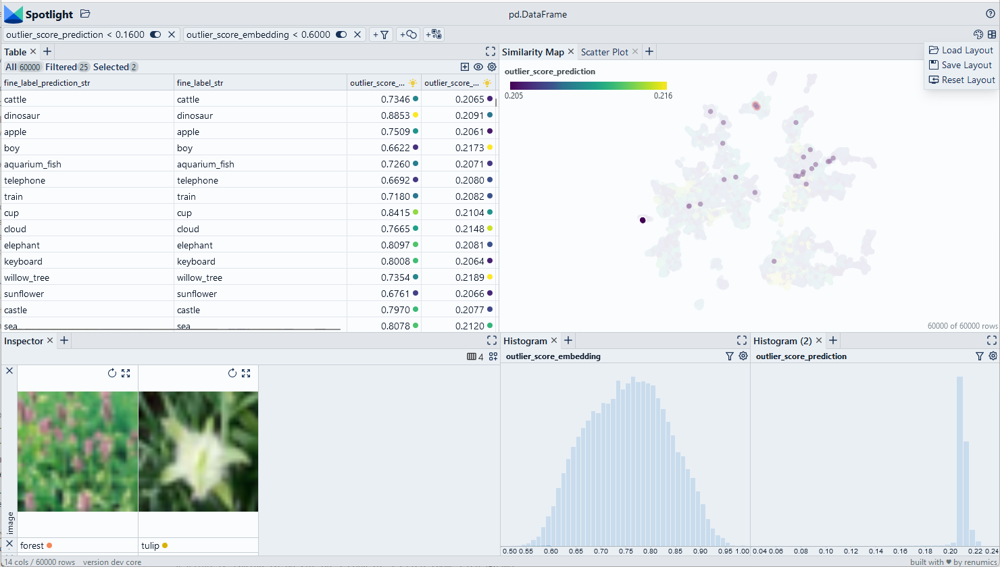

# Find outliers with Cleanlab

We use the [Cleanlab library](https://github.com/cleanlab/cleanlab) to compute outlier scores. We then manually inspect the data points to correct them.

> Use Chrome to run Spotlight in Colab. Due to Colab restrictions (e.g. no websocket support), the performance is limited. Run the notebook locally for the full Spotlight experience.

<a
    target="_blank"
    href="https://colab.research.google.com/github/Renumics/spotlight/blob/main/playbook/veteran/outlier_cleanlab.ipynb"
>
    
</a>

=== "inputs"

    -   `df['probabilities']` contain the [class probability vector](../glossary/index.md#probabilities) that was inferred by the model
    -   `df['embedding']` contain the [embeddings](../glossary/index.md#embedding) for each data sample

=== "outputs"

    -   `df_leak['outlier_score_embedding']` contains an outlier score [0,1] that was computed based on the embedding of each data sample.
    -   `df_leak['outlier_score_prediction']` contains an outlier score [0,1] that was computed based on the inferred probabilities of each data samples.

=== "parameters"



## Imports and play as copy-n-paste functions

??? note "# Install dependencies"

    ```python
    #@title Install required packages with PIP

    !pip install renumics-spotlight cleanlab datasets
    ```

??? note "# Play as copy-n-paste functions"

    ```python
    #@title Play as copy-n-paste functions

    import datasets
    from renumics import spotlight
    from cleanlab.outlier import OutOfDistribution
    import numpy as np
    import pandas as pd
    import requests

    def outlier_score_cleanlab(df, embedding_name='embedding', probabilities_name='probabilities', label_name='labels'):

        embs = np.stack(df[embedding_name].to_numpy())
        probs = np.stack(df[probabilities_name].to_numpy())
        labels = df[label_name].to_numpy()

        ood = OutOfDistribution()
        ood_train_feature_scores = ood.fit_score(features=np.stack(embs))
        ood_train_predictions_scores = ood.fit_score(pred_probs=probs, labels=labels)

        df_out=pd.DataFrame()
        df_out['outlier_score_embedding']=ood_train_feature_scores
        df_out['outlier_score_prediction']=ood_train_predictions_scores

        return df_out
        return df_out
    ```

## Step-by-step example on CIFAR-100

### Load CIFAR-100 from Huggingface hub and convert it to Pandas dataframe

```python
dataset = datasets.load_dataset("renumics/cifar100-enriched", split="train")
df = dataset.to_pandas()
```

### Compute outlier scores with Cleanlab

```python
df_outliers = outlier_score_cleanlab(df, label_name='fine_label')
df = pd.concat([df, df_outliers], axis=1)
```

### Inspect outliers and remove them with Spotlight

```python
df_show = df.drop(columns=['embedding', 'probabilities'])
layout_url = "https://raw.githubusercontent.com/Renumics/spotlight/refs/playbook/veteran/outlier_cleanlab.json"
response = requests.get(layout_url)
layout = spotlight.layout.nodes.Layout(**json.loads(response.text))
spotlight.show(df_show, dtype={"image": spotlight.Image, "embedding_reduced": spotlight.Embedding}, layout=layout)
```
