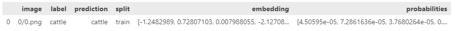

# 🚀 Getting Started

> Spotlight helps you to **understand unstructured datasets** fast. You can create **interactive visualizations** from your dataframe with just a few lines of code. You can also leverage data enrichments (e.g. embeddings, prediction, uncertainties) to **identify critical clusters** in your data.


## What you'll need

-   [Python](https://www.python.org/downloads/) version 3.8-3.11

## Install Spotlight via [pip](https://packaging.python.org/en/latest/key_projects/#pip)

```bash
pip install renumics-spotlight
```

> We recommend installing Spotlight and everything you need to work on your data in a separate [virtual environment](https://docs.python.org/3/tutorial/venv.html)

## Load your first dataset

Data can be loaded into Spotlight either from memory (as Python object) or from file. We currently support Pandas dataframes as well as Huggingface datasets and our own HDF5-based dataset format. Depending on the format, unstructured data samples are either stored directly in the dataframe or as a path to a separate file.

This is an example how your dataframe might look like:



You can directly load your dataframe either via the Python API or the command line interface (CLI):

=== "python"

    ```python
    import pandas as pd
    from renumics import spotlight

    df = pd.read_csv("https://raw.githubusercontent.com/Renumics/spotlight/refs/heads/main/data/mnist/mnist-tiny.csv")
    spotlight.show(df, dtype={"image": spotlight.Image, "embedding": spotlight.Embedding})
    ```

    -   `pd.read_csv` loads a sample csv file as a pandas [DataFrame](https://pandas.pydata.org/docs/reference/api/pandas.DataFrame.html).
    -   `spotlight.show` opens up spotlight in the browser with the pandas dataframe ready for you to explore.
    -   The `dtype` argument specifies custom column types for the browser viewer.

=== "CLI"

    ```bash
    curl https://raw.githubusercontent.com/Renumics/spotlight/refs/heads/main/data/mnist/mnist-tiny.csv -o mnist-tiny.csv
    spotlight mnist-tiny.csv --dtype image=Image --dtype embedding=Embedding
    ```

## Load a [Hugging Face](https://huggingface.co/) dataset

Huggingface datasets have a rich semantic description of the feature columns. Spotlight can thus parse data type descriptions and label mappings automatically. This means that creating a visualization is typically as simple as:

```python
import datasets
from renumics import spotlight

ds = datasets.load_dataset('speech_commands', 'v0.01', split='all')

spotlight.show(ds)
```

## Exploring an enriched dataset with custom visualization layouts

Exploring raw unstructured datasets often yield little insights. Leveraging model results such as predictions or embeddings can help to uncover critical data samples and clusters. In practice, these enrichments can be stored in a separate dataframe and then joined with the raw dataset. Here is an example from the Huggingface hub:

```python
import datasets

ds = datasets.load_dataset('speech_commands', 'v0.01', split='all')
ds_results = datasets.load_dataset('renumics/speech_commands-ast-finetuned-results', 'v0.01', split='all')
ds = datasets.concatenate_datasets([ds, ds_results], axis=1)
```

Depending on the task at hand (e.g. EDA, model debugging, monitoring), you probably want to set up a suitable visualization layout. You can do so in the GUI and via API. We also ship starter layouts for common tasks that you can use out of the box:

```python
from renumics import spotlight

layout = spotlight.layouts.debug_classification(embedding='embedding', inspect={'audio': spotlight.dtypes.audio_dtype})
spotlight.show(ds, dtype={'embedding': spotlight.Embedding}, layout=layout )
```

## Disclaimer

??? note "Usage Tracking"

    We have added crash report and perfomance collection.<br />
    **We do NOT** collect user data other than an **anonymized Machine Id** obtained by py-machineid, and only log our own actions.<br />
    **We do NOT** collect folder names, dataset names, or row data of any kind only aggregate performance statistics like total time of a table_load, crash data, etc.<br />
    Collecting spotlight crashes will help us improve stability.<br />

    <br />
    <br />
    Too opt out of the crash report collection define an environment variable called
    SPOTLIGHT_OPT_OUT and set it to true.

    e.G.

    ```bash
    export SPOTLIGHT_OPT_OUT=true
    ```
