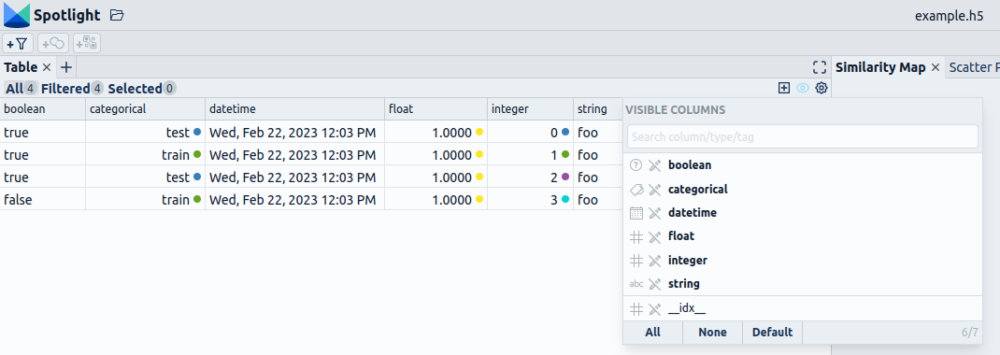
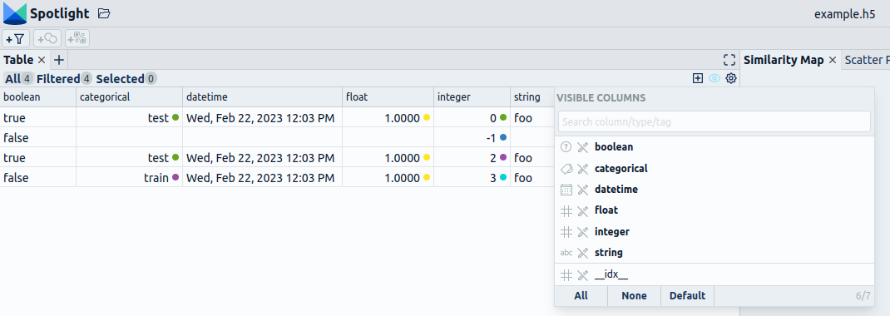

# Loading Data from Spotlight HDF5

Spotlight provides a [`dataset`](../API/dataset.md) class that is backed by the [HDF5](https://en.wikipedia.org/wiki/Hierarchical_Data_Format) format. This format is very flexible and supports a wide range of unstructured multimodal data.

The Spotlight dataset is the best choice, if your data types are not well supported by Pandas or Huggingface datasets (e.g. geometric or simulation data).

## Writing and loading a HDF5 file

In this example, we save an image dataset as Spotlight H5:

```python
from sklearn import datasets
import numpy as np
from renumics import spotlight

OUTPUT_DATASET = "image_example_dataset.h5"

digits = datasets.load_digits()
with spotlight.Dataset(OUTPUT_DATASET, "w") as dataset:
    dataset.append_int_column("index", order=1)
    dataset.append_int_column("label", order=0)
    dataset.append_image_column("image")
    for i, (image, label) in enumerate(zip(digits.images, digits.target)):
        # in the sample dataset the value 0 means white and 16 means black
        # in order to display it correctly in the browser, we need to switch that
        # to have 0 as black and 255 as white
        image = (255 * (1 - image / 16)).round().astype("uint8")
        # scale image by 32 along each dimension in order to display it in the browser
        image = np.repeat(image, 32, axis=1)
        image = np.repeat(image, 32, axis=0)

        dataset.append_row(index=i, label=label, image=image)
```

We can add data enrichments:

```python
from sklearn.decomposition import PCA

pca_embeddings = PCA(8).fit_transform(digits.data)
with spotlight.Dataset(OUTPUT_DATASET, "a") as dataset:
    dataset.append_embedding_column("pca", pca_embeddings)
```

The HDF5 files can be easily loaded through the Spotlight Python API or directly from the file system within the Spotlight file browser:

```python
spotlight.show(OUTPUT_DATASET)
```

## Supported data types

As discussed in the [data types section](supported_data_types.md#supported-data-types), the HDF5 format supports a wide variety of tabular and unstructured data:

Here is an example that includes different kinds of tabular data:

```python
with spotlight.Dataset("example.h5", "w") as dataset:
    dataset.append_bool_column("boolean", [True, False, False, True])
    dataset.append_int_column("integer", range(4))
    dataset.append_float_column("float", 1.0)
    dataset.append_string_column("string", "foo")
    dataset.append_categorical_column(
        "categorical", ["test", "train", "test", "train"]
    )
    dataset.append_datetime_column("datetime", datetime.now())

spotlight.show("example.h5")
```

??? note "Spotlight"

    

## Appending data to the dataset

With the help of the [Dataset](../API/dataset.md) wrapper, you can also add columns or rows to an already created Dataset by opening the Dataset in **append mode**.

```python
with spotlight.Dataset("example.h5", "w") as dataset:
    dataset.append_bool_column("boolean", [True, True, True, False], default=False)
    dataset.append_int_column("integer", range(4), default=-1)
    dataset.append_float_column("float", 1.0, optional=True)
    dataset.append_string_column("string", "foo", optional=True)
    dataset.append_categorical_column(
        "categorical", ["test", "train", "test", "train"], optional=True
    )
    dataset.append_datetime_column("datetime", datetime.now(), optional=True)

with spotlight.Dataset("example.h5", "a") as dataset:
    dataset[1] = {key: None for key in dataset.keys()}

spotlight.show("example.h5")
```

??? note "Spotlight"

    

## Detailed examples

Take a look at our [use case section](../use_cases/index.md) to find more detailed examples for different modalities.
