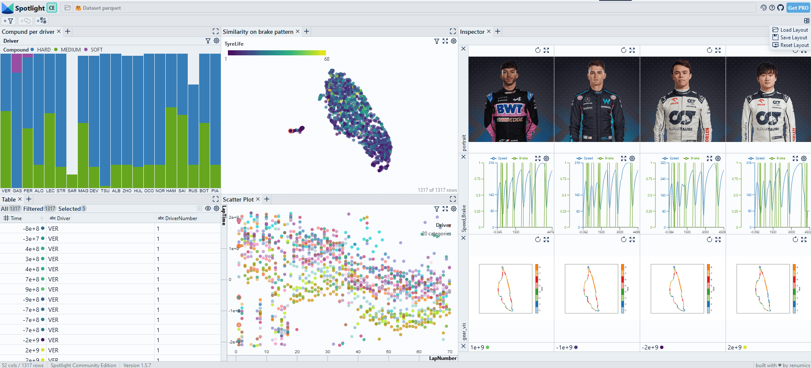

# Analyze formula1 race data



First install the dependencies:

```bash
pip install renumics-spotlight fastf1
```

## Loading the data with the fastf1 library

We load data from the F1 Montreal 2023 GP through the FastF1 library:

```python
import fastf1

session = fastf1.get_session(2023, 'Montreal', 'Race')

session.load(telemetry=True, laps=True)

laps = session.laps
```

We want to analyze the data on a per-lap basis. The fastf1 library provides an API that does the necessary slicing and interpolation. We use this API to extract the sequences for Speed, RPM etc. per lap.

```python
import numpy as np
import pandas as pd
from tqdm import tqdm

def extract_telemetry(laps, columns):
    df_telemetry = pd.DataFrame(columns=columns)
    row_dict = {}

    for index, lap in tqdm(laps.iterlaps(), total=laps.shape[0]):
        telemetry = lap.get_telemetry()
        for column in columns:
            row_dict[column] = [telemetry['Distance'].tolist(), telemetry[column].tolist()]
        df_telemetry.loc[index]=row_dict

    return df_telemetry

columns = ["DistanceToDriverAhead", "RPM", "Speed", "nGear", "Throttle", "Brake", "DRS", "X", "Y", "Z"]
df_telemetry = extract_telemetry(laps, columns)
```

> We save the telemetry data as a Python list of list. This format is compatible with PyArrows. This means we can save the dataset as .parquet or we can convert it to a Hugging Face dataset. A 2D Numpy array is not supported by PyArrows.

## Visualize with Spotlight

We concatenate the dataframes:

```python
#concat the dataframes
df_metadata = pd.DataFrame(laps)
df = pd.concat([df_metadata, df_telemetry], axis=1)
```

And visualize the data in Spotlight:

```python
from renumics import spotlight

spotlight.show(df)
```

## Memory-efficient saving and loading time series data

### Saving and loading time series data with Pandas

For datasets that easily fit into memory, Pandas-based data formats work very well. We can save the dataset as a Parquet file:

```python
df.to_parquet('f1telemetry.parquet.gzip', compression='gzip')
```

We can then load back from this file. When measuring the memory footprint

```python
import pandas as pd
import psutil

print('memory used in MB:', psutil.virtual_memory()[3]/ 1024 ** 2)
df = pd.read_parquet('f1telemetry.parquet.gzip')
print('memory used in MB:', psutil.virtual_memory()[3]/ 1024 ** 2)
```

we find that the dataset uses approximately 300MB of RAM.

### Saving and loading time series data with Hugging Face / PyArrows

We can convert the Pandas dataframe to a Hugging Face dataset:

```python
import datasets

ds = datasets.Dataset.from_pandas(df)

ds.save_to_disk('f1telemetry')
```

When we load the Arrows-based dataset, we only use a negligible amount of RAM due to the memory-mapping functionality from Arrows:

```python
import datasets
import psutil

print('memory used in MB:', psutil.virtual_memory()[3]/ 1024 ** 2)
ds = datasets.Dataset.load_from_disk('f1telemetry')
print('memory used in MB:', psutil.virtual_memory()[3]/ 1024 ** 2)
```

When we visualize the Arrows-based dataset with Spotlight, all time series data is loaded lazily. In this way, even large datasets can easily be processed:

```python
from renumics import spotlight

spotlight.show(ds)
```
