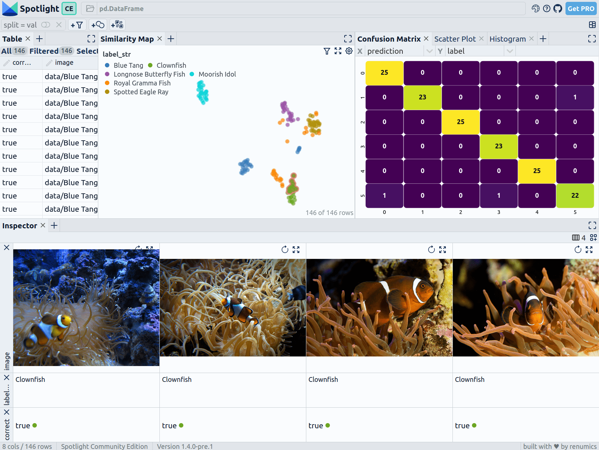

# Easily fine-tune a ViT with images from Bing search

Use the [**sliceguard**](https://github.com/Renumics/sliceguard) library and [**Spotlight**](https://github.com/Renumics/spotlight)
to fine-tune a ViT model for image classification and detect problematic clusters in a dataset created from Bing search in a few lines of code.

### First install the dependencies:

```
pip install renumics-spotlight sliceguard[all]
```

### Then run the following code to create a dataset from Bing search and fine-tune a ViT model for image classification:

```python
# The Imports
from renumics import spotlight
from sliceguard.data import create_imagedataset_from_bing
from sliceguard.models.huggingface import finetune_image_classifier, generate_image_pred_probs_embeddings
from sliceguard.embeddings import generate_image_embeddings

# Create an Image Dataset from Bing
class_names = [
    "Blue Tang",
    "Clownfish",
    "Spotted Eagle Ray",
    "Longnose Butterfly Fish",
    "Moorish Idol",
    "Royal Gramma Fish",
]
df = create_imagedataset_from_bing(
    class_names, 25, "data", test_split=0.2, license="Free to share and use"
)

# DataFrame Format:
#+----+-------------------------------------+-------------------+---------+---------+
#|    | image                               | label_str         |   label | split   |
#|----+-------------------------------------+-------------------+---------+---------|
#|  6 | data/Blue Tang/Image_15.jpg         | Blue Tang         |       0 | val     |
#| 73 | data/Spotted Eagle Ray/Image_11.jpg | Spotted Eagle Ray |       2 | train   |
#| 51 | data/Spotted Eagle Ray/Image_13.jpg | Spotted Eagle Ray |       2 | train   |
#| 57 | data/Spotted Eagle Ray/Image_7.jpg  | Spotted Eagle Ray |       2 | val     |
#| 31 | data/Clownfish/Image_10.jpg         | Clownfish         |       1 | train   |
#| 27 | data/Clownfish/Image_13.jpg         | Clownfish         |       1 | train   |
#+----+-------------------------------------+-------------------+---------+---------+

# Fine-tune a ViT Model with the data (in 1-2 minutes on a GPU)
finetune_image_classifier(
    df[df["split"] == "train"],
    model_name="google/vit-base-patch16-224-in21k",
    output_model_folder="./model_folder",
    epochs=15,
)

# Enrich the DataFrame with Predictions, Probabilities and Embeddings
df["prediction"], df["probs"], df["embeddings"] = generate_image_pred_probs_embeddings(
    df["image"].values, model_name="./model_folder"
)
# Check the result and detect problematic clusters
spotlight.show(
    df, layout="https://raw.githubusercontent.com/Renumics/spotlight/main/docs/assets/playbook/image_classification_v1.0.json"
)
```

### Explore the results with Spotlight


